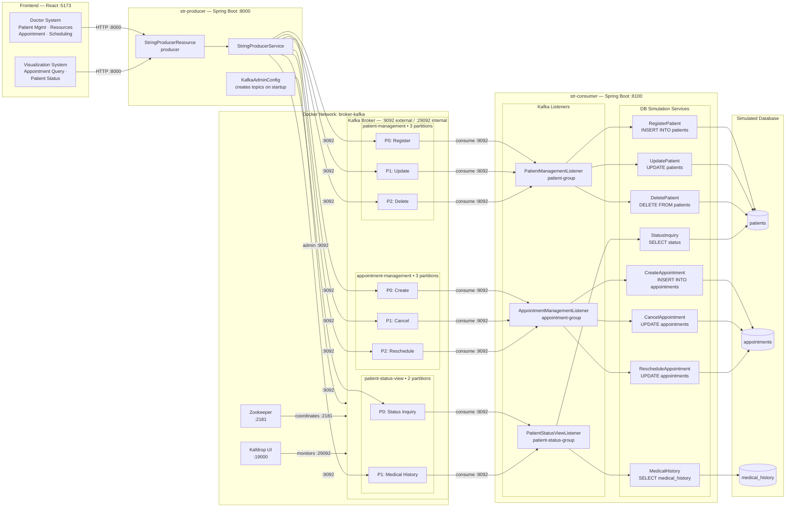

# Infrastructure Diagram

```mermaid
graph LR
    subgraph FRONTEND["Frontend — React :5173"]
        FE1["Doctor System 
        Patient Mgmt · Resources
        Appointment · Scheduling"]
        FE2["Visualization System
        Appointment Query ·
        Patient Status"]
    end

    subgraph PRODUCER["str-producer — Spring Boot :8000"]
        REST["StringProducerResource
        producer"]
        PSVC["StringProducerService"]
        KADM["KafkaAdminConfig
        creates topics on startup"]
    end

    subgraph DOCKER["Docker Network: broker-kafka"]
        ZK["Zookeeper
        :2181"]
        subgraph KAFKA["Kafka Broker — :9092 external / :29092 internal"]
            subgraph PATMGMT["patient-management  •  3 partitions"]
                PMP0["P0: Register"]
                PMP1["P1: Update"]
                PMP2["P2: Delete"]
            end
            subgraph APTMGMT["appointment-management  •  3 partitions"]
                AMP0["P0: Create"]
                AMP1["P1: Cancel"]
                AMP2["P2: Reschedule"]
            end
            subgraph PATSTATUS["patient-status-view  •  2 partitions"]
                PSP0["P0: Status Inquiry"]
                PSP1["P1: Medical History"]
            end
        end
        KD["Kafdrop UI
        :19000"]
    end

    subgraph CONSUMER["str-consumer — Spring Boot :8100"]
        subgraph LISTENERS["Kafka Listeners"]
            LP["PatientManagementListener
            patient-group"]
            LA["AppointmentManagementListener
            appointment-group"]
            LST["PatientStatusViewListener
            patient-status-group"]
        end
        subgraph DBSIM["DB Simulation Services"]
            SREG["RegisterPatient
            INSERT INTO patients"]
            SUPD["UpdatePatient
            UPDATE patients"]
            SDEL["DeletePatient
            DELETE FROM patients"]
            SCRE["CreateAppointment
            INSERT INTO appointments"]
            SCAN["CancelAppointment
            UPDATE appointments"]
            SRES["RescheduleAppointment
            UPDATE appointments"]
            SSTQ["StatusInquiry
            SELECT status"]
            SMED["MedicalHistory
            SELECT medical_history"]
        end
    end

    subgraph SIMDB["Simulated Database"]
        DBPAT[("patients")]
        DBAPT[("appointments")]
        DBMED[("medical_history")]
    end

    FE1 -->|"HTTP :8000"| REST
    FE2 -->|"HTTP :8000"| REST
    REST --> PSVC
    KADM -->|"admin :9092"| KAFKA
    ZK -->|"coordinates :2181"| KAFKA
    KD -->|"monitors :29092"| KAFKA

    PSVC -->|":9092"| PMP0
    PSVC -->|":9092"| PMP1
    PSVC -->|":9092"| PMP2
    PSVC -->|":9092"| AMP0
    PSVC -->|":9092"| AMP1
    PSVC -->|":9092"| AMP2
    PSVC -->|":9092"| PSP0
    PSVC -->|":9092"| PSP1

    PMP0 -->|"consume :9092"| LP
    PMP1 -->|"consume :9092"| LP
    PMP2 -->|"consume :9092"| LP
    AMP0 -->|"consume :9092"| LA
    AMP1 -->|"consume :9092"| LA
    AMP2 -->|"consume :9092"| LA
    PSP0 -->|"consume :9092"| LST
    PSP1 -->|"consume :9092"| LST

    LP --> SREG
    LP --> SUPD
    LP --> SDEL
    LA --> SCRE
    LA --> SCAN
    LA --> SRES
    LST --> SSTQ
    LST --> SMED

    SREG --> DBPAT
    SUPD --> DBPAT
    SDEL --> DBPAT
    SCRE --> DBAPT
    SCAN --> DBAPT
    SRES --> DBAPT
    SSTQ --> DBPAT
    SMED --> DBMED
```